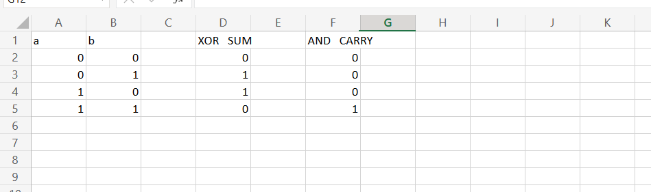
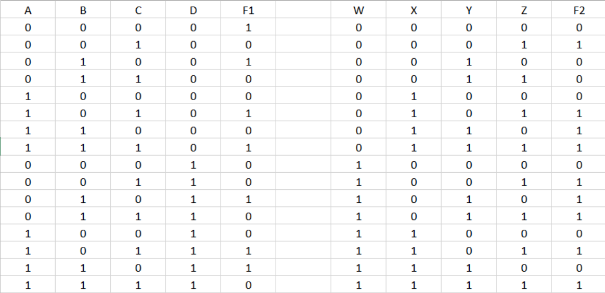
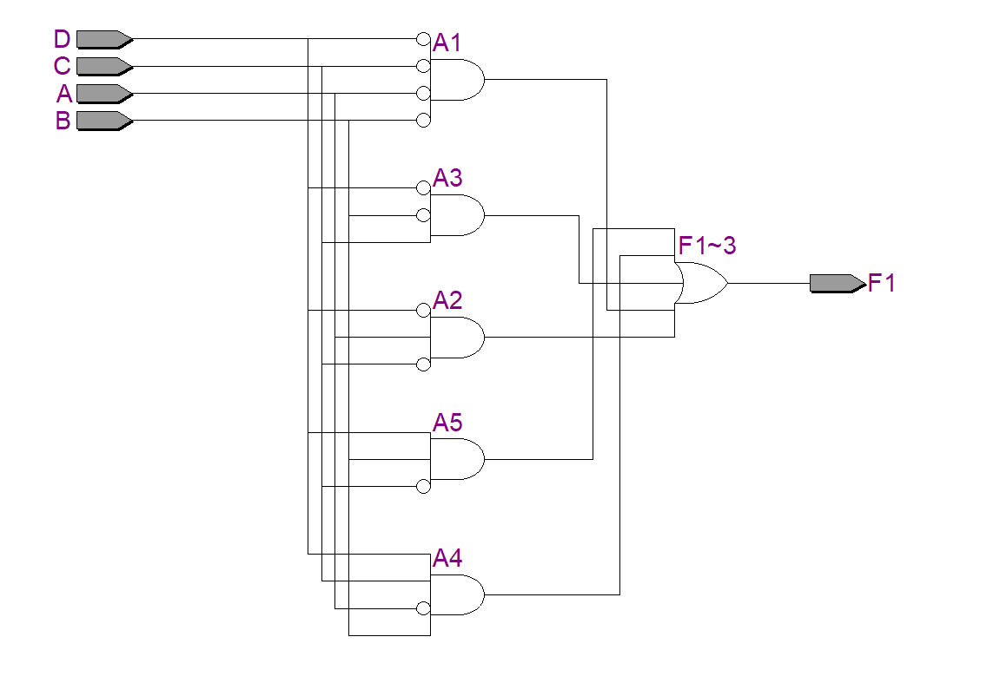
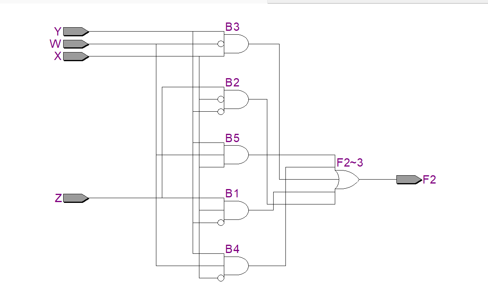
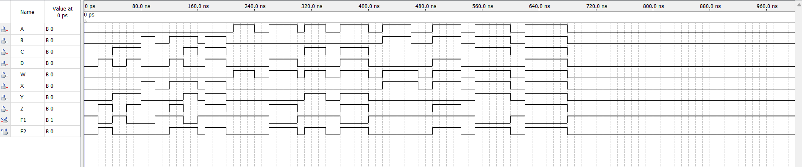

# Experiment--04-Implementation-of-combinational-logic-using-universal-gates
Implementation of combinational logic using universal-gates
 
## AIM:
To implement the given logic function using NAND and NOR gates and to verify its operation in Quartus using Verilog programming.

F=((C'.B.A)'(D'.C.A)'(C.B'.A)')' using NAND gate
F=(((C.B'.A)+(D.C'.A)+(C.B'.A))')' using NOR gate
## Equipments Required:
## Hardware – PCs, Cyclone II , USB flasher
## Software – Quartus prime


## Theory
Logic gates are electronic circuits which perform logical functions on one or more inputs to produce one output. 

## Using NAND gates
NAND gate is actually a combination of two logic gates i.e. AND gate followed by NOT gate. So its output is complement of the output of an AND gate.This gate can have minimum two inputs, output is always one. By using only NAND gates, we can realize all logic functions: AND, OR, NOT, X-OR, X-NOR, NOR. So this gate is also called as universal gate. First note that the entire expression is inverted and we have three terms ANDed. This means that we must use a 3-input NAND gate. Each of the three terms is, itself, a NAND expression. Finally, negated single terms can be generates with a 2-input NAND gate acting as an inverted.

F=((C'.B.A)'(D'.C.A)'(C.B'.A)')'

## Logic Diagram

Using NOR gates
NOR gate is actually a combination of two logic gates: OR gate followed by NOT gate. So its output is complement of the output of an OR gate. This gate can have minimum two inputs, output is always one. By using only NOR gates, we can realize all logic functions: AND, OR, NOT, Ex-OR, Ex-NOR, NAND. So this gate is also called universal gate. Designing a circuit with NOR gates only uses the same basic techniques as designing a circuit with NAND gates; that is, the application of deMorgan’s theorem. The only difference between NOR gate design and NAND gate design is that the former must eliminate product terms and the later must eliminate sum terms.

F=(((C.B'.A)+(D.C'.A)+(C.B'.A))')'

## Logic Diagram

## Procedure
## Program:
/*
Program to implement the given logic function using NAND and NOR gates and to verify its operations in quartus using Verilog programming.
Developed by: praveen s
RegisterNumber:  212222240077
```
module tt1(A,B,C,D,W,X,Y,Z,F1,F2);
input A,B,C,D,W,Y,X,Z;
output F1,F2;
wire A1,A2,A3,A4,A5,B1,B2,B3,B4,B5;
assign A1 = ((~A)&(~B)&(~C)&(~D));
assign A2=(A&(~C)&(~D));
assign A3=((~B)&C&(~D));
assign A4=((~A)&B&C&D);
assign A5=(B&(~C)&D);
assign B1=(X&(~Y)&Z);
assign B2=((~X)&(~Y)&Z);
assign B3=((~W)&X&Y);
assign B4=(W&(~X)&Y);
assign B5=(W&X&Y);
assign F1=(A1|A2|A3|A4|A5);
assign F2=(B1|B2|B3|B4|B5);
endmodule
```
*/
## RTL realization

## Output:
## TRUTH TABLE

## RTL
### F1


### F2

## Timing Diagram

## Result:
Thus the given logic functions are implemented using NAND and NOR gates and their operations are verified using Verilog programming.
